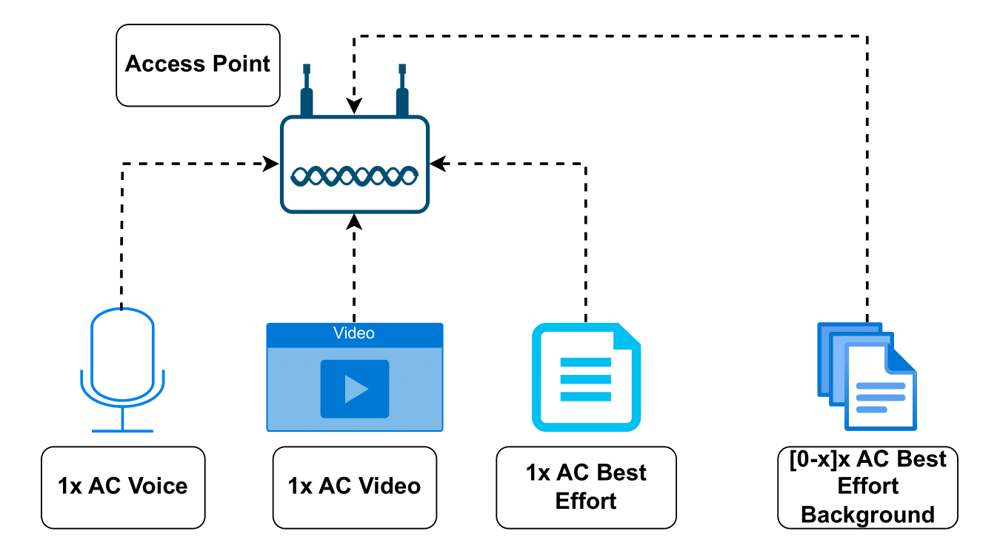
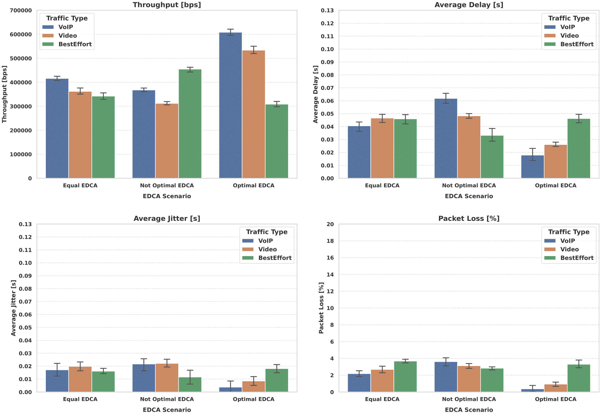
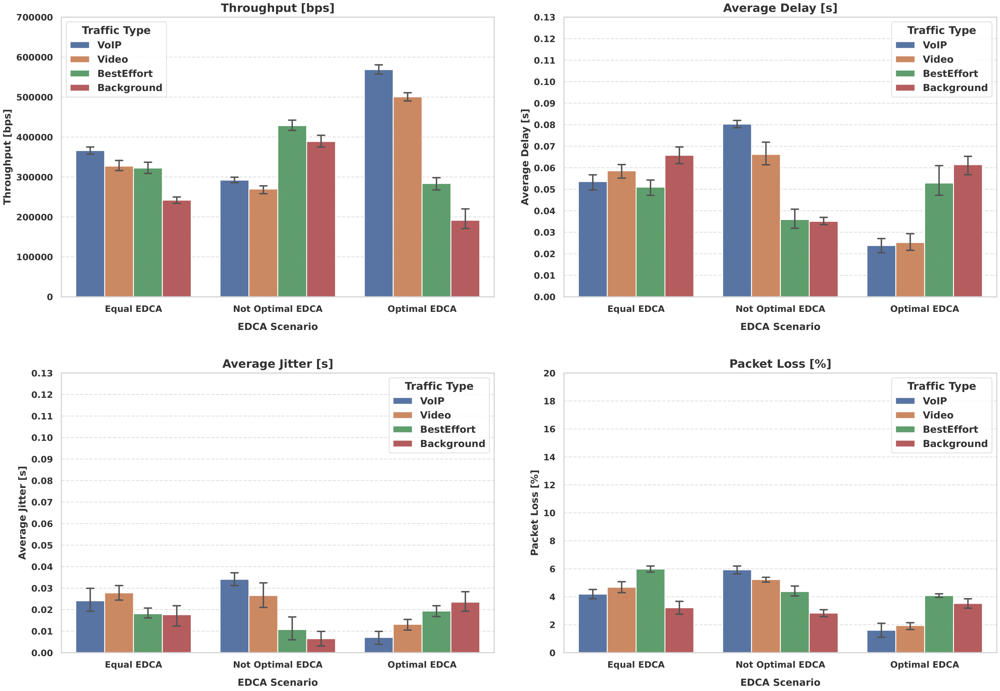
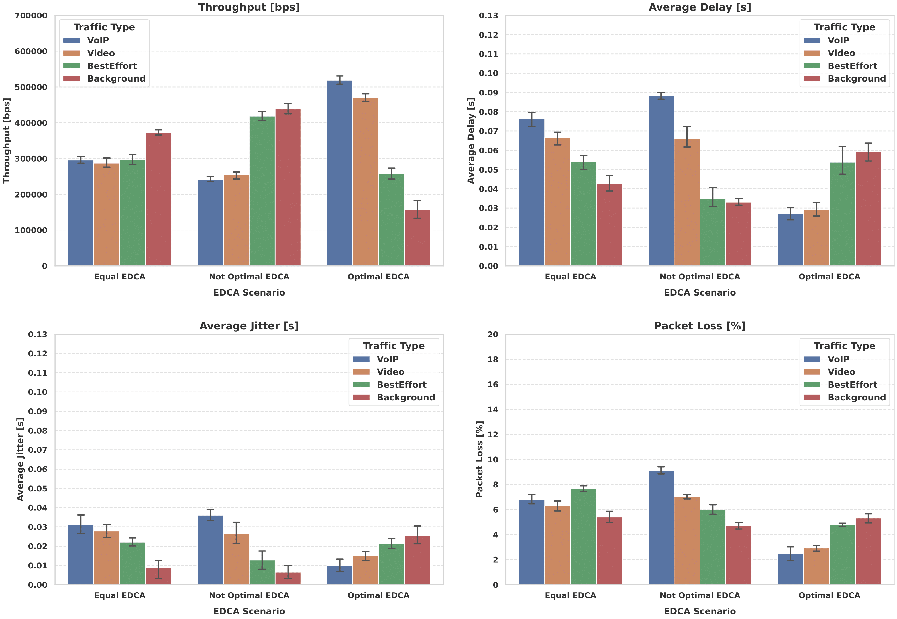

# QoS Impact of EDCA Configuration in Wi-Fi 6 (IEEE 802.11ax)


-orange)

> **Goal –** Quantify how manual tuning of *Enhanced Distributed Channel Access (EDCA)*  
> affects Quality-of-Service for voice / video / best-effort traffic in dense Wi-Fi 6 networks.  
> *Team coursework project for the Teleinformatics (ICT) programme.*

---

## Table of Contents
1. [Project Highlights](#project-highlights)  
2. [Prerequisites](#prerequisites)  
3. [Quick Start](#quick-start)  
4. [Simulation Scenarios](#simulation-scenarios)  
5. [Results](#results)  
6. [Conclusions](#conclusions)  

---

## Project Highlights
- **ns-3 simulation in C++ 17** with the full IEEE 802.11ax PHY/MAC stack.  
- **Python automation** sweeps parameters, seeds multiple runs and exports stats as JSON/CSV.  
- **Metrics analysed:** throughput, latency, jitter, packet-loss.  
- *Optimised* EDCA cuts VoIP median latency by **> 80 %** and slashes packet-loss below **0.1 %** with 10 background stations.  
- Reproducible, single-command workflow – CI-ready.

---

## Prerequisites

| Tool            | Tested Version | Notes                             |
|-----------------|---------------:|-----------------------------------|
| **ns-3**        | 3.43 release   | built via integrated CMake tool   |
| **Python**      | ≥ 3.10 (3.11)  | `matplotlib`, `pandas`, `numpy`   |
| **CMake + gcc** | C++ 17 stack   | to compile ns-3                   |

---

## Quick Start

```bash
# 1) clone ns-3 3.43
git clone https://gitlab.com/nsnam/ns-3-dev.git ns-3.43
cd ns-3.43 && git checkout 3.43

# 2) configure & build (CMake backend)
./ns3 configure
./ns3 build

# 3) run an example scenario (optimal EDCA, 10 background STAs, 120-s sim)
./ns3 run scratch/qos_project2.cc \
  --enableEdca=true \
  --enableBackground=true \
  --nBgStations=10 \
  --simTime=120.0 \
  --output=results/opt_edca_bg10.json \
  --RngRun=42
```

> **Tip:** to execute **all** predefined scenarios and generate plots, simply run  
> ```bash
> python scripts/qos_project2_script.py
> ```

---

## Simulation Scenarios

| Scenario             | Background STAs | EDCA settings                              |
|----------------------|-----------------|-------------------------------------------|
| `disable_edca`       | 0 / 3 / 10       | EDCA off – all ACs share identical DCF    |
| `equal_edca`         | 0 / 3 / 10       | Same CW / AIFS / TXOP for VO + VI + BE    |
| `not_optimal_edca`   | 0 / 3 / 10       | Mis-prioritised (BE favoured)             |
| **`optimal_edca` ★** | 0 / 3 / 10       | Priorities: VO > VI > BE (per 802.11ax)   |

**Traffic generators**  
• VoIP – 320 B / 20 ms • Video – 1 880 B / 15 ms • Best-Effort – 1 500 B / 2 ms  

---

## Results

### Testbed Topology  
<p align="center">
  
</p>

### Key Metrics Dashboards

| Background STAs | Preview |
|-----------------|---------|
|   |  |
|   |  |
|  |  |

---

## Conclusions
- **EDCA is critical:** correct queue prioritisation drastically improves real-time traffic performance.  
- **Latency focus:** with `optimal_edca`, VoIP delay stays below 20 ms even under heavy load (10 STAs).  
- **Mis-configuration costs:** `not_optimal_edca` inflates jitter up to 6× and packet-loss beyond 10 %.  
- **Practical takeaway:** tuning Contention Windows and TXOP per Access Category is a low-cost, high-impact lever for QoS in Wi-Fi 6 deployments.
```
